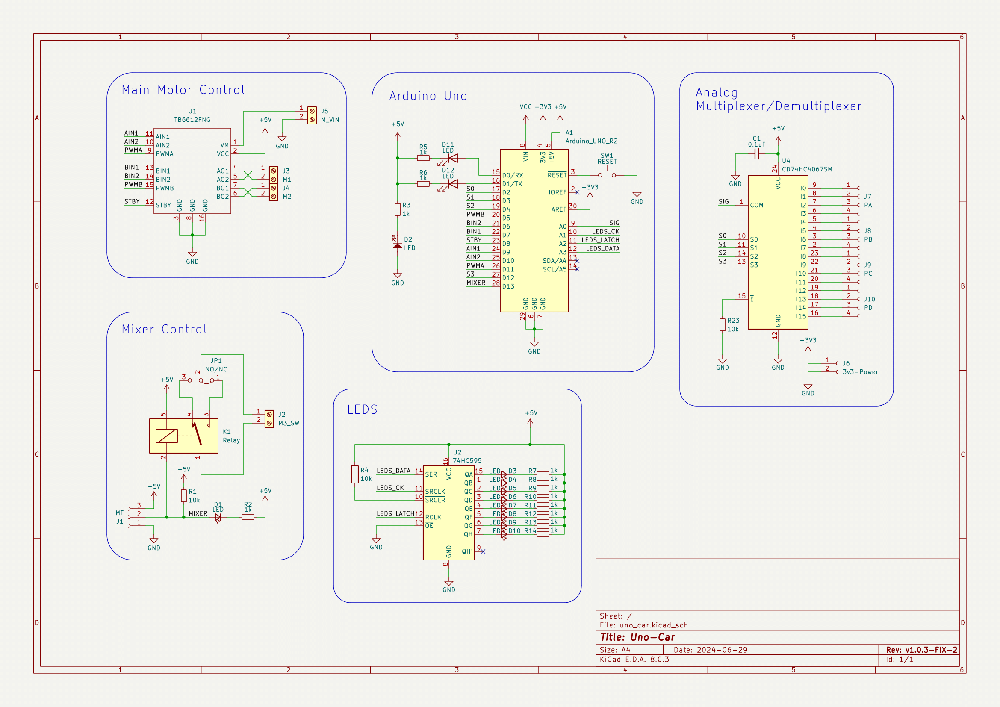

# Uno Car V1.0.3 library

該函數庫主要用來控制 Uno Car V1.0.3 擴展版，該擴展板包含 8顆可控 LED、16通道復用器、兩顆馬達控制及一顆繼電器。

## 注意

由於繼電器訊號腳位，為 D13，在開發版啟動時 D13 腳位會閃爍，導致繼電器開/關，若介意，可重新燒入 Arduino BootLoader:

1. [移除閃爍後的 Arduino Uno BootLoader](./extras/optiboot_atmega328-no-led.hex)
2. [原始 Arduino Uno BootLoader](./extras/optiboot_atmega328.hex)
